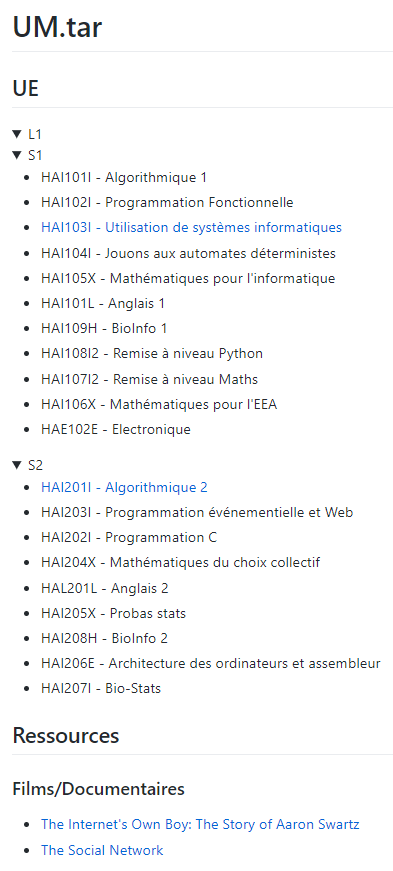

# Rapport

Participants : Marc-Antoine MOUTTET, Arthur DE FAYS, Aurélien BIDAUT.

## Introduction

Notre projet se base sur un besoin de centraliser les cours, fiches, exercices et corrections des Unités d'Enseignement en informatique.

Langages utilisés :

- Markdown pour l'écriture du rapport et certaines pages du site.
- PHP pour le coté serveur du site, permettra de faire des requêtes SQL et contrôler l'accès au site.
- SQL pour la base de données des utilisateurs, exercices.

## Etapes du projet

- MK1 : Authentification et Amélioration du site (1 à 2 séances):

  - Utilisation d'un alias de l'adresse mail principale du site internet. verify@mma.dev pour envoyer les mails de vérification.
  - Envoie un email avec code de vérification pour valider l'adresse mail universitaire de l'étudiant.
  - Le compte utilisateur est ensuite vérifié et peut accéder à la totalité du site.
  - L'authenticité de l'utilisateur est vérifié à chaque requête.
  - Amélioration du système de navigation dans le site.
  - Mise en place de la mise en page et du CSS.

- MK2 : Exercices statiques + cours (2 à 3 séances):

  - Ajout d'exercices de bases et de leurs corrections.
  - Ajout de fiches de cours.

- MK3 : Exercices dynamiques :

  - Création d'un programme qui créer des fiches de partiel, avec des valeurs aléatoires, et de leurs corrections respectives.

- MK4 : enregistrement des exercices générés dans notre compte:

  - Possibilité d'enregistrer les fiches générées dans un onglet à part.

- MK+ : Etape bonus si on a le temps. En effet, pour chaque exercice, rendre une note et un barême.

## Détails de chaque séance

### Séance 1 (17/01/23)

Nous avons mis nos idées en ordre, puis défini un plan de séance et enfin mis en place nos objectifs. De plus, nous avons répartis certaines tâches entre les membres du groupe :

- MK1 : Marc-Antoine.
- MK2 : Aurélien et Arthur.
- MK3 : A définir.
- MK4 : A définir.

### 18/01/23-23/01/23

MK1 : Marc-Antoine

Le site avait besoin d'un système d'authentification n'autorisant l'accès qu'aux élèves de l'Université de Montpellier. Un compte utilisateur possède généralement entant qu'identifiant de connexion un nom d'utilisateur ou un email. Pour cela, la façon la plus simple de vérifier l'authenticité de l'utilisateur au seins de l'Université de Montpellier était d'utiliser son adresse email universitaire (prénom.nom@etu.umontpellier.fr). Pour se créer un compte, l'utilisateur est invité à aller sur [la page de création de compte](https://mma.dev/um/signup.html). Sur celle ci, il est invité à renseigner :

- son adresse email universitaire
- un mot de passe de 14 caractères minimum

L'utilisateur doit aussi cocher une case signifiant qu'il reconnait utiliser les ressources fournies seulement à des fins d'éducation et personnelle. _Cette partie sera modifier afin d'inclure plus d'explications à nos utilisateurs et mieux encadrer leurs droits et devoirs_

L'utilisateur peut ensuite cliquer sur le bouton s'inscrire.

à noter que : Le site utilise un certificat TLS/1.3 de la société Let's Encrypt, afin de garantir la sécurité des données échangées entre le serveur et le client. Ceci permet de protéger les données échanger entre le serveur et le client, comme les mots de passe, les adresses email, etc. Le serveur et le client utilisent un protocole de communication sécurisé, le HTTPS, qui permet de chiffrer les données échangées. Cette sécurité est nécéssaire afin de protéger le serveur et le client d'être victimes d'attaques, comme par exemple : Man In The Middle (MITM). _Man In The Middle (L'homme du milieu) consiste à intercepter les données échangées entre le serveur et le client, afin de les modifier ou de les voler._

Voici une capture d'écran de la page de création de compte :

_un lien permettant de se connecter sera potentiellement ajouté sur cette page ultérieurement_

Une fois le bouton s'inscrire appuyé, l'utilisateur est invité, si la requête d'envoie d'email à bien pu être effectuée, à vérifier son adresse email universitaire où il retrouvera un code de vérification à rentrer sur la page de création de compte. Une fois rentré et validé, l'utilisateur est redirigé vers [la page d'utilisation du site](https://mma.dev/um/connected.html). L'utilisateur peut en cas de problème/non réception de l'email cliquer sur le lien "Renvoyer le code de vérification". Il se vera alors renvoyer un nouvel email avec un nouveau code de vérification. _Suite à l'utilisation d'un code de vérification, ce dernier est ensuite invalidé dans la base de données._

L'utilisateur peut aussi changer son mot de passe, pour cela, il doit être sur [la page de connexion](https://mma.dev/um/login.html) et cliquer sur le lien "Mot de passe oublié". Il aura ensuite la possibilité après avoir renseigné son adresse email universitaire et confirmer son identité via un code reçu sur son email de rentrer un nouveau mot de passe.

Voici une capture d'écran de la page de connexion :

---

Afin de protéger toutes les pages du site, celles ci dès lors de leur requête par un utilisateur au serveur éxécutent un fichier php permettant de vérifier l'existence et l'authenticité de la session. Pour cela, nous utilisions `session_start()` qui nous permet de démarrer une session. Nous vérifions si les variables de session dont nous avons besoins existent, comme : le timestamp de création de session, l'email, le hash du mot de passe, l'ID utilisateur et l'ID de session php. Le timestamp de création de session est utilisé pour vérifier si la session n'a pas expiré. _Une session expire toutes les 24 heures, ceci afin d'assurer la sécurité du site et des utilisateurs._ Les autres variables de sessions servent afin que l'utilisateur puissent utiliser le site sans avoir à se reconnecter à chaque fois. Mais ces variables servent aussi à vérifier l'authenticité de l'utilisateur. L'email permet dans un premier temps de vérifier si le compte existe bel et bien. Le hash du mot de passe permet de vérifier si le mot de passe est valide, c'est à dire que celui de la session va être comparé à celui de la base de données, si ils sont identiques alors c'est bon. Le hash de mot de passe à un rôle similaire à un token, en cas de changement de mot de passe, celui là change et rend invalide toutes les autres sessions. L'ID de session est aussi envoyé au serveur, afin de vérifier si l'ID de session est valide. Ceci permet de limite le nombre de session simultanée d'un utilisateur à une seule afin d'améliorer la sécurité du site. Si une de ces variables n'existe pas ou n'est pas valide, l'utilisateur est redirigé vers [la page de connexion](https://mma.dev/um/login.html). Si toutes les variables sont valides, l'utilisateur peut accéder à la page demandée.  
L'ID de session est régénéré à chaque fois que l'utilisateur se connecte et est mis à jour dans la base de données, afin d'éviter les attaques de type fixation de session. _L'attaque par fixation de session consiste à forcer l'utilisateur à utiliser et entrer ses données sur une session que l'attaquant a créé, l'attaquant peut ensuite utiliser le numéro de session pour usurper l'utilisateur._

En résumé, le site permet pour le moment de se créer un compte, vérifier son compte via un code de vérification, changer son mot de passe, se connecter, accéder au contenu de certaines UEs et télécharger des fichiers.

Voici une capture d'écran de la page principale du site une fois connecté :

---

Voici une capture d'écran de la page de téléchargement d'un fichier :

---

Voici une capture d'écran de la page d'une UE :

---

Voici une capture d'écran de la page d'accueil du site :

---

TODO : Nettoyer le code, ajouter des commentaires, mieux utiliser mes fonctions, protéger le téléchargement des fichiers, passer certaines pages HTML en PHP et vice versa.
